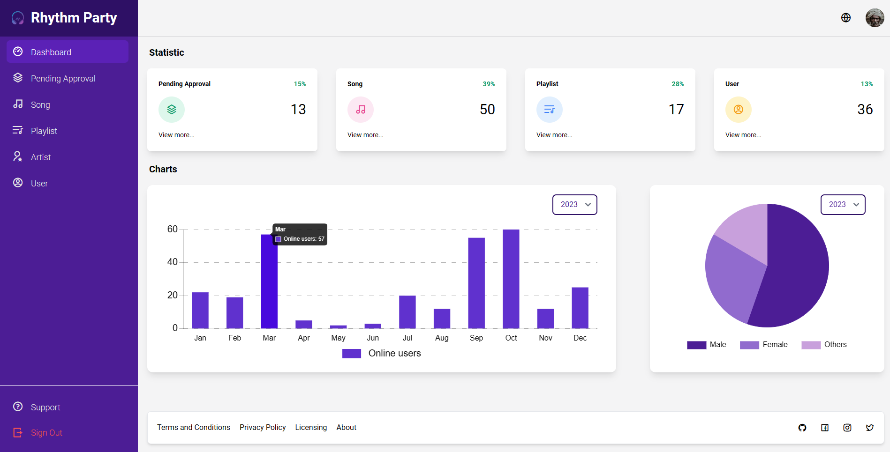

#  Rhythm Party (Website for Admin)
A website that provides an user-friendly interface for administrators to manage client's site interactions. It is built using the Client-Server architecture.

## Features

- Modern visual dashboard.
- Song approval management.
- Song management.
- Playlist management.
- Artist management.
- User management.
- Send reports/feedback to developer team.
- And other features.

## Requirement

- Runtime environment:
    - Node.js 20.10.0+
    - MongoDB for database storage.
    - Firebase Storage for file storage.
    - Vercel for hosting.

- Development environment:
    - Node.js 20.10.0+.
    - React.js 18.2.0+ for frontend development.
    - Tailwind CSS for styling.
    - MongoDB for database storage.
    - Firebase Storage for file storage.

## Installation Guide

To install and run the project locally, follow these steps:

1. Clone this repo.
2. Run `npm install` to install the dependencies.
3. Run `npm start` to start the server.

## User Guide

You can simply click this [link](https://rhythm-party-admin.vercel.app/) to get started.

## User Interface

## Authors

[Phan Tuấn Thành](https://github.com/thanhpt1110)

[Nguyễn Phúc Bình](https://github.com/leesoonduck3009)

[Lê Quốc Dũng](https://github.com/DungLe2983)
